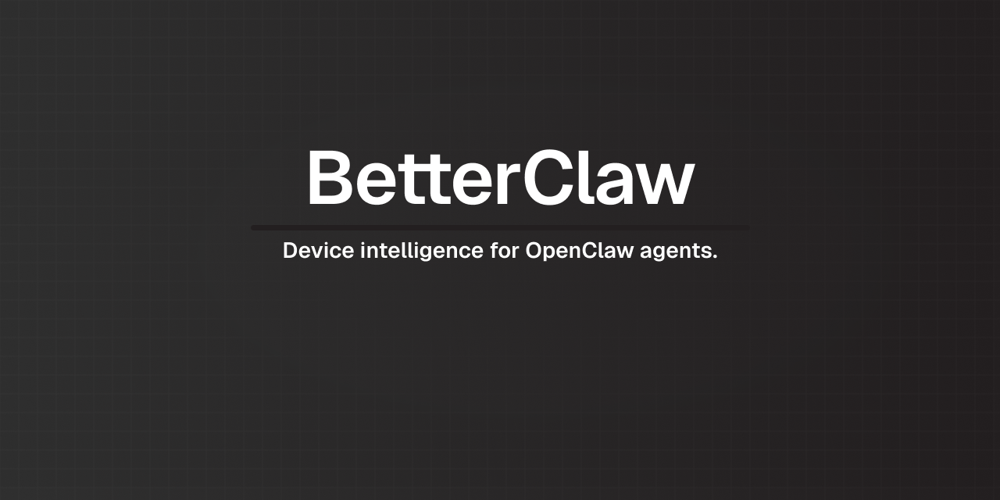

<p align="center">
  
</p>

<p align="center">
  <em>OpenClaw plugin for the BetterClaw iOS app</em>
</p>

<p align="center">
  <a href="https://www.npmjs.com/package/@betterclaw-app/betterclaw"></a>
  <a href="https://github.com/BetterClaw-app/betterclaw/blob/main/LICENSE"></a>
  <a href="https://www.npmjs.com/package/@betterclaw-app/betterclaw"></a>
  <a href="https://openclaw.dev"></a>
</p>

---

## What is this?

This is the server-side plugin for [BetterClaw](https://github.com/BetterClaw-app/BetterClaw-ios), an iOS app that connects your iPhone's sensors to your [OpenClaw](https://openclaw.dev) AI agent. The app streams device events (location, battery, health, geofences) to your gateway — this plugin decides what to do with them.

Without this plugin, raw events go straight to your agent. With it, they're filtered, triaged, and enriched before anything reaches your agent's conversation.

```
  BetterClaw iOS App          This Plugin (on gateway)              Agent
 ──────────────────          ────────────────────────             ────────
                                       │
  battery ──────▶  ┌───────────────────┼───────────────────┐
  location ─────▶  │  Rules Engine     │  Context Store     │
  health ───────▶  │  LLM Triage       │  Pattern Engine    │ ──▶  filtered events
  geofence ─────▶  │  Budget Limiter   │  Proactive Triggers│      + full context
                   └───────────────────┼───────────────────┘
                                       │
                                 proactive insights
                              (low battery + away from
                               home, sleep deficit, etc.)
```

## Features

- **Smart Filtering** — Per-source dedup, cooldown windows, and a daily push budget prevent event spam
- **LLM Triage** — Ambiguous events get a cheap LLM call to decide push vs. suppress, keeping the expensive agent focused
- **Device Context** — Rolling state snapshot: battery, GPS, zone occupancy, health metrics, activity classification
- **Pattern Recognition** — Computes location routines, health trends (7d/30d baselines), and event stats every 6 hours
- **Proactive Insights** — Combined-signal triggers: low battery away from home, unusual inactivity, sleep deficit, routine deviations, weekly digest
- **Agent Tool** — `get_context` tool lets your agent read the full device snapshot on demand

## Requirements

- [BetterClaw iOS app](https://github.com/BetterClaw-app/BetterClaw-ios) installed and connected to your gateway
- [OpenClaw](https://openclaw.dev) gateway (2025.12+)

## Install

```bash
openclaw plugins install @betterclaw-app/betterclaw
```

## Configure

Add to your `openclaw.json`:

```jsonc
{
  "plugins": {
    "entries": {
      "betterclaw": {
        "enabled": true,
        "config": {
          "llmModel": "openai/gpt-4o-mini",
          "pushBudgetPerDay": 10,
          "patternWindowDays": 14,
          "proactiveEnabled": true
        }
      }
    }
  }
}
```

All config keys are optional — defaults are shown above.

### Config Reference

| Key | Default | Description |
|-----|---------|-------------|
| `llmModel` | `openai/gpt-4o-mini` | Model used for ambiguous event triage |
| `pushBudgetPerDay` | `10` | Max events forwarded to the agent per day |
| `patternWindowDays` | `14` | Days of event history used for pattern computation |
| `proactiveEnabled` | `true` | Enable proactive combined-signal insights |

## How It Works

### Event Pipeline

Every device event from the BetterClaw app goes through a multi-stage pipeline before reaching your agent:

1. **Rules Engine** — Checks dedup, cooldown timers, and daily budget. Obvious spam is dropped immediately.
2. **LLM Triage** — Events that aren't clearly push or suppress get a fast LLM call with device context for a judgment call.
3. **Context Update** — The device context store is updated with the latest sensor data regardless of whether the event is forwarded.
4. **Event Logging** — Every event and its decision (push/suppress/defer) is logged for pattern computation.
5. **Agent Injection** — Events that pass are injected into the agent's main session with formatted context.

### Background Services

Two engines run on a schedule in the background:

- **Pattern Engine** (every 6h) — Analyzes event history to compute location routines, health trends, and event frequency stats
- **Proactive Engine** (every 30min) — Evaluates combined-signal conditions and fires insights when thresholds are met

## Commands

| Command | Description |
|---------|-------------|
| `/bc` | Show current device context snapshot in chat |

## Compatibility

| Plugin | BetterClaw iOS | OpenClaw |
|--------|----------------|----------|
| 1.x    | 1.x+           | 2025.12+ |

## License

[AGPL-3.0](LICENSE) — Free to use, modify, and self-host. Derivative works must remain open source.
