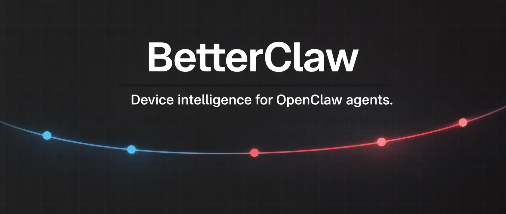

<p align="center">
  
</p>

<p align="center">
  <em>OpenClaw plugin for the BetterClaw iOS app</em>
</p>

<p align="center">
  <a href="https://www.npmjs.com/package/@betterclaw-app/betterclaw"></a>
  <a href="https://github.com/BetterClaw-app/betterclaw/blob/main/LICENSE"></a>
  <a href="https://www.npmjs.com/package/@betterclaw-app/betterclaw"></a>
  <a href="https://openclaw.dev"></a>
</p>

---

## What is this?

This is the server-side plugin for [BetterClaw](https://betterclaw.app), an iOS app that connects your iPhone's sensors to your [OpenClaw](https://openclaw.dev) AI agent. The app streams device events (location, battery, health, geofences) to your gateway — this plugin decides what to do with them.

The plugin differentiates between **free** and **premium** tiers:

- **Free** — passive context store. The agent can pull device snapshots via `get_context`, but no events are pushed proactively.
- **Premium** — full smart mode pipeline with rules-based filtering, LLM triage, engagement tracking, and a daily learner that adapts to your preferences.

<p align="center">
  <picture>
    
  </picture>
</p>

## Features

- **Tier-Aware Routing** — `check_tier` tool tells the agent whether to use node commands (premium, fresh data) or `get_context` (free, cached snapshots). Includes a 24h cache TTL so the agent doesn't re-check every turn.
- **Free = Pull-Only** — Events are stored for context but never triaged or pushed. `get_context` with staleness indicators (`dataAgeSeconds`) is the only data source.
- **Premium Smart Mode** — Rules engine + LLM triage with fail-closed error handling and budget-aware prompts. Daily push budget prevents event spam.
- **Engagement Tracking** — Deterministic transcript scanner finds pushed messages by timestamp, then an LLM classifies user engagement as `engaged`, `ignored`, or `unclear`. Feeds into the learner.
- **Adaptive Learner** — Daily subagent builds a simplified triage profile (`summary` + `interruptionTolerance`) from event history, engagement data, and workspace memory.
- **Calibration Period** — First 3 days after install, triage runs in rules-only mode while the system collects engagement data. Skipped automatically for users upgrading from v2.
- **Device Context** — Rolling state snapshot with per-field timestamps and `dataAgeSeconds`: battery, GPS, zone occupancy, health metrics, activity classification.
- **Pattern Recognition** — Daily analysis computes location routines, health trends (7d/30d baselines), and event frequency stats.
- **Per-Device Config** — iOS app can override push budget at runtime via RPC.
- **Agent Tools** — `check_tier` for routing decisions, `get_context` for patterns/trends/cached state.
- **CLI Setup** — `openclaw betterclaw setup` configures gateway allowedCommands automatically.

## Requirements

- [BetterClaw iOS app](https://github.com/BetterClaw-app/BetterClaw-ios) installed and connected to your gateway
- [OpenClaw](https://openclaw.dev) gateway (2025.12+)

## Install

```bash
openclaw plugins install @betterclaw-app/betterclaw
openclaw betterclaw setup   # configures gateway allowedCommands
```

## Configure

Add to your `openclaw.json`:

```jsonc
{
  "plugins": {
    "entries": {
      "betterclaw": {
        "enabled": true,
        "config": {
          "triageModel": "openai/gpt-4o-mini",
          "pushBudgetPerDay": 10,
          "patternWindowDays": 14,
          "analysisHour": 5,
          "calibrationDays": 3
        }
      }
    }
  }
}
```

All config keys are optional — defaults are shown above.

### Config Reference

| Key | Default | Description |
|-----|---------|-------------|
| `triageModel` | `openai/gpt-4o-mini` | Model for per-event triage and engagement classification |
| `triageApiBase` | -- | Optional base URL for OpenAI-compatible endpoint (e.g., Ollama) |
| `pushBudgetPerDay` | `10` | Max events forwarded to the agent per day |
| `patternWindowDays` | `14` | Days of event history used for pattern computation |
| `analysisHour` | `5` | Hour (0-23, system timezone) for daily pattern + learner analysis |
| `calibrationDays` | `3` | Days of rules-only triage before learner profile kicks in |

> **Migration from v2:** `llmModel` still works as a deprecated alias for `triageModel`. `proactiveEnabled` is ignored (proactive triggers removed in v3).

## How It Works

### Event Pipeline

Every device event from the BetterClaw app goes through the plugin:

<p align="center">
  <picture>
    
  </picture>
</p>

### Background Services

- **Pattern Engine + Reaction Scanner + Learner** (daily at `analysisHour`) — Computes location routines, health trends, event stats. Then scans session transcripts for engagement with past pushes (deterministic timestamp search + LLM classification). Finally runs a subagent to build a personalized triage profile from engagement data and workspace memory.

### Agent Tools

| Tool | Purpose |
|------|---------|
| `check_tier` | Returns tier + routing instructions + cache TTL. No device data. Call first. |
| `get_context` | Returns patterns, trends, zone state, cached device snapshots with `dataAgeSeconds`. |

### Gateway RPCs

| RPC | Direction | Purpose |
|-----|-----------|---------|
| `betterclaw.event` | iOS -> plugin | Send a device event for processing |
| `betterclaw.ping` | iOS -> plugin | Heartbeat: sync tier + smartMode, init calibration |
| `betterclaw.config` | iOS -> plugin | Per-device settings override |
| `betterclaw.context` | iOS -> plugin | Full context for iOS Context tab (includes `calibrating` flag) |
| `betterclaw.snapshot` | iOS -> plugin | Bulk device state catch-up |
| `betterclaw.learn` | iOS -> plugin | Trigger on-demand triage profile learning |

## Commands

| Command | Description |
|---------|-------------|
| `/bc` | Show current device context snapshot in chat |

## Compatibility

| Plugin | BetterClaw iOS | OpenClaw |
|--------|----------------|----------|
| 3.x    | 2.x+           | 2025.12+ |
| 2.x    | 2.x+           | 2025.12+ |
| 1.x    | 1.x            | 2025.12+ |

## License

[AGPL-3.0](LICENSE) -- Free to use, modify, and self-host. Derivative works must remain open source.
